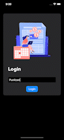

# Expense Tracker in SwiftUI
An app to manage your expenses which you have wasted till now, used MVVM architecture.



## Persistence of Transactions
I have built a cache manager to store all the user transactions data in the memory as a cache. If you want to implement your custom class to manage them.
create your own class which conforms to the protocol `UserTransaction` and pass it as a parameter(dependency injection) when initializing the `TransactionListViewModel` inside `Expense_TrackerApp.swift`.

```Swift
protocol UserTransaction {
    func isUserAlreadyExist(userName: String) -> Bool
    func removeUser(userName: String)
    func saveTransaction(userName: String, transactions: [Transaction])
    func getTransactions(userName: String) -> [Transaction]
    func removeTransaction(userName: String, transactions: [Transaction])
    func getUserExpenseModel(userName: String) -> UserExpenseModel?
}
```

### Packages Used
[SwiftUICharts](https://github.com/willdale/SwiftUICharts) | [SwiftUIFontIcon](https://github.com/huybuidac/SwiftUIFontIcon)
